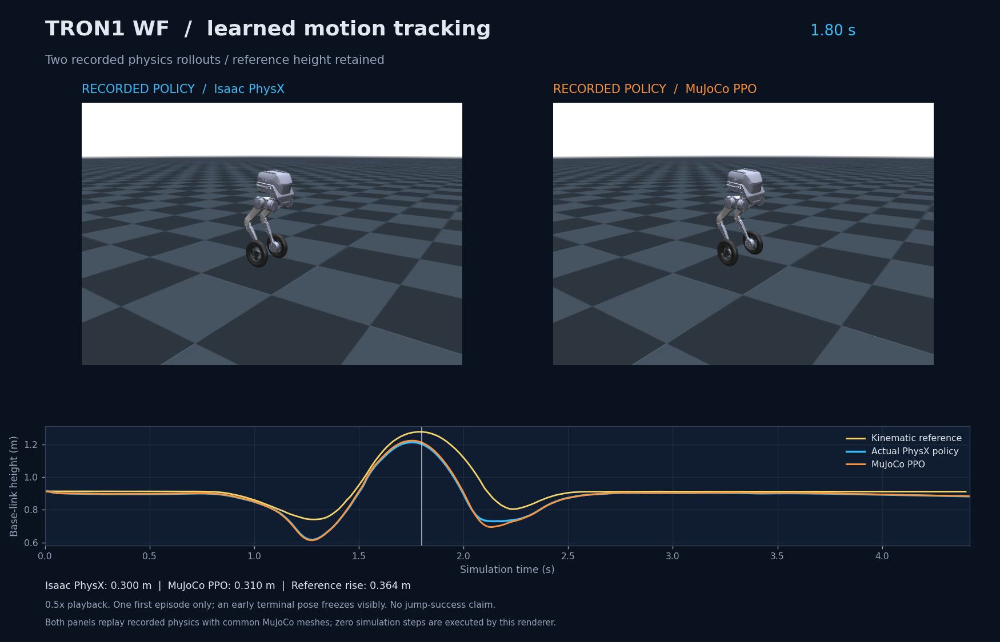

# TRON1 Learning from Human

Early jump demonstration — CMU `16_03`, DC1600 policy: takeoff, landing, and recovery in Isaac and MuJoCo. Click the preview to watch.

[Jump video](results/2026-10-03-sim2sim/tracking_comparison.mp4) · [Assessment](results/2026-10-03-sim2sim/assessment.json) · [Original pilot video (MuJoCo ended early)](results/2026-10-02-tron1-jump/tracking_comparison.mp4)

## 1. Motivation

Can a wheel-legged robot reproduce selected human-inspired motions and transfer the same learned controller between physics simulators?

This project combines the TRON1 WF robot model with publicly available CMU motion-capture data. We build robot motion references, learn feedback control in Isaac Sim, and evaluate the same policy in MuJoCo without retraining. The goal is a small, reproducible sim2sim study—not full human-motion imitation or hardware deployment.

## 2. Method

### Human motion to robot reference

We decode CMU ASF/AMC recordings and extract three positional landmarks: the pelvis and both ankles. Pelvis orientation is also used. After heading alignment, uniform scaling, and morphology-dependent offsets, the pelvis maps to the robot base and the ankles map to wheel-center targets.

A TRON1-specific adapter uses GMR's two-stage inverse kinematics to generate the floating-base pose and six leg-joint trajectories. Wheel-center motion is included; wheel spin is not a human-derived tracking target. These are kinematic references, not evidence that the motion is dynamically feasible. The training export adds velocities, resamples to 50 Hz, and appends a terminal hold.

Forward jump, turning jump, sideways jump, and step-up use this GMR pipeline. Rolling stop and crouch instead use explicit wheel-task adaptations: duration is doubled, and displacement or crouch depth is adjusted. They are not unmodified human imitation or direct GMR outputs. See the [reference recipes](config/suite/motion_suite.json).

### Reference to learned control

We use BeyondMimic-style motion tracking with PPO, reusing its motion commands, tracking rewards, and adaptive reference-state initialization through a custom TRON1 configuration. The policy learns feedback control in physics; the base trajectory is not prescribed during rollout.

The eight policy outputs are clipped elementwise to `[-1, 1]` and split into six leg actions and two wheel actions:

$$
a = \operatorname{clip}(\pi_\theta(o), -1, 1), \qquad a \in [-1,1]^8
$$

$$
q_{\mathrm{des,leg}} = q_0 + (1.0\;\mathrm{rad})\,a_{\mathrm{leg}},
\qquad
\tau_{\mathrm{cmd,wheel}} = (12\;\mathrm{N\,m})\,a_{\mathrm{wheel}}.
$$

Here, `q₀` is the fixed leg pose at reference frame zero—not the time-varying reference. Leg targets use PD control (`Kp = 500`, `Kd = 10`); wheels use direct torque commands. Applied torques pass through the DC-motor torque–speed envelope and shaft-resistance model, with nominal output limits of 80 N·m for legs and 12 N·m for wheels. These are simulation settings, not verified hardware ratings.

There is no reference wheel torque: PPO learns wheel actions from tracking rewards and interaction with the simulator. Wheel-center position/velocity remain tracking objectives, but wheel axial rotation is excluded. The [control contract](training/tron1_tracking.py) defines the exact observations and actions.

## 3. Experiments and Training Environment

| Item | Setup |
|---|---|
| Training | RTX 4090 D; Isaac Sim 5.1 / PhysX; Isaac Lab 2.3; Torch 2.7; RSL-RL 3.0.1 |
| Cross-simulator evaluation | MuJoCo 3.9.0; Torch 2.5.1; same actor and observation normalization |
| Control | 50 Hz policy, 200 Hz physics; 51 actor observations, 8 actions |
| Budget per motion | 2,048 environments × 600 PPO updates; approximately 29.49 million environment steps; seed 42 |

Each motion has a separate policy fine-tuned from the same previous jump checkpoint, not trained from scratch. We evaluate the predesignated final checkpoint. Training randomizes wheel shaft resistance (0–0.3 N·m), motor no-load speed (0.85–1.00× nominal), and torque capacity (0.85–1.00× nominal). Parameters stay fixed within each episode; 20% of resets use nominal parameters.

Every demonstration uses **human keypoints → kinematic reference → Isaac policy → MuJoCo policy**, with synchronized task time and height curves. The policy panels replay recorded physics, not reference animation. Adaptations and terminal holds are labeled; all videos use 0.5× playback.

| Motion / CMU clip | Result in Isaac / MuJoCo | Four-panel video |
|---|---|---|
| Forward jump / `16_05` | Pass; base rise 13.45 / 14.77 cm | [Watch](results/2026-10-03-motion-pipeline-suite/forward_jump/motion_pipeline.mp4) |
| Turning jump / `83_51` | Pass under the defined gates, but only 33.32° / 38.90° of airborne turn—not 90° | [Watch](results/2026-10-03-motion-pipeline-suite/turn_jump/motion_pipeline.mp4) |
| Sideways jump / `141_05` | Fail; insufficient rise and sideways excursion; reference defects retained | [Watch](results/2026-10-03-motion-pipeline-suite/side_jump/motion_pipeline.mp4) |
| Rolling stop / `16_08`, adapted | Pass; starts already rolling, not from standstill | [Watch](results/2026-10-03-motion-pipeline-suite/rolling_stop/motion_pipeline.mp4) |
| Crouch / `134_01`, adapted | Pass; depth 16.36 / 16.42 cm against an 18 cm reference | [Watch](results/2026-10-03-motion-pipeline-suite/crouch/motion_pipeline.mp4) |
| Step-up / `83_03` | Fail; neither rollout finishes with both wheels on the 11.64 cm ledge | [Watch](results/2026-10-03-motion-pipeline-suite/step_up/motion_pipeline.mp4) |

Four of six tasks pass the predefined gates in both engines, with the turning-jump caveat above. Each task has only one nominal-condition evaluation per engine, starting from reference frame zero and its initial velocities. This is not a statistical success rate or proof of robustness for all six motions. Contact evidence is incomplete, and no hardware validation is claimed. The ledge geometry is estimated from mocap, not measured from the original CMU scene.

[Video gallery](results/2026-10-03-motion-pipeline-suite/index.html) · [Metrics and assessments](results/2026-10-03-motion-suite/summary.json) · [Detailed experiment log and reproduction instructions](EXPERIMENT_LOG.md)

Credits: [CMU data sources and acknowledgment](config/mocap_sources.json), [pinned GMR adapter](config/gmr_retarget_wf.json), [BeyondMimic license](notices/BeyondMimic-LICENCE.txt), and [LimX TRON1 model license](notices/LimX-TRON1-LICENSE.txt). Third-party code, models, and data retain their original terms; raw mocap, robot assets, and checkpoints are not redistributed here.
