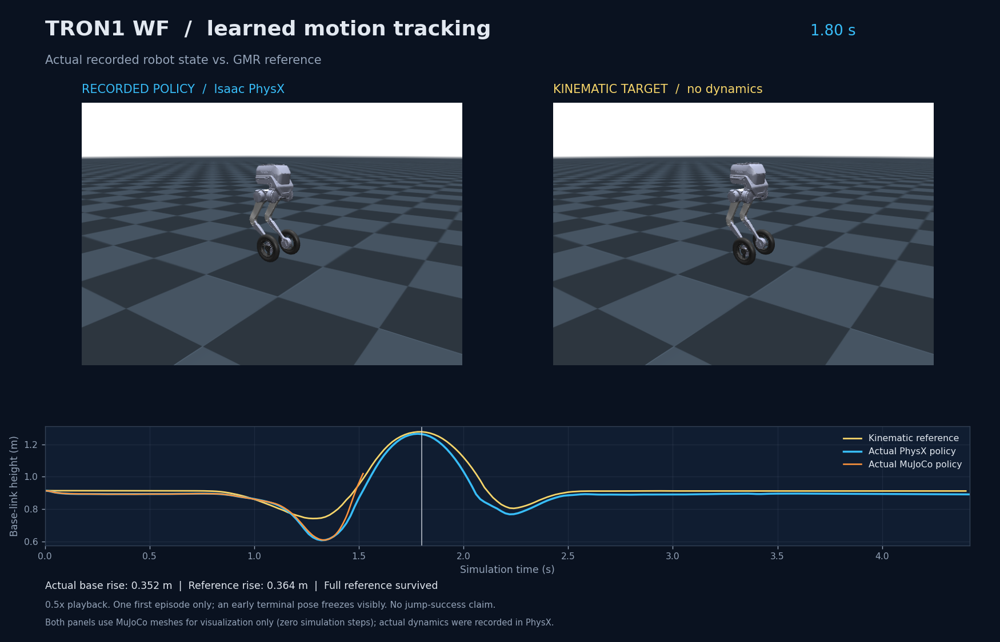

# TRON1 Learning from Human

## 最新結果：三軸 domain randomization（2026-10-03）

輪軸阻力、馬達無負載轉速與馬達扭矩能力的 DR 續訓已完成。
使用預先指定的最終 checkpoint，在同一組 16 個未用於訓練的獨立參數 draw 上，
MuJoCo 完整跳躍驗收由原策略 **0/16 提升至 15/16**；名義條件兩策略都通過。
DR 策略在名義條件與一組固定弱化條件的 Isaac／MuJoCo sim2sim 也均通過。

[配對驗證逐筆結果](results/2026-10-03-domain-randomization/paired_validation.json) ·
[訓練與參數稽核](results/2026-10-03-domain-randomization/training_summary.json) ·
[雙引擎驗收摘要](results/2026-10-03-domain-randomization/evaluation_summary.json) ·
[固定弱化條件影片](results/2026-10-03-domain-randomization/tracking_comparison.mp4)

這是小型、固定初始姿態的模擬驗證集，不代表一般條件下或真機的成功率；保留 1 組失敗，未放寬驗收門檻。
新策略名義跳躍的峰值傾角也較大，改善不代表所有追蹤品質指標都提升。範圍與完整限制見末節。

## 前一階段：DC1600 單次跳躍 sim2sim（2026-10-03）

[Isaac／MuJoCo 並排影片](results/2026-10-03-sim2sim/tracking_comparison.mp4) ·
[嚴格驗收報告](results/2026-10-03-sim2sim/assessment.json) ·
[結果與來源摘要](results/2026-10-03-sim2sim/summary.json)


同一個含 normalizer 的 actor，在 Isaac／PhysX 與 MuJoCo 都完成 4.42 秒的起跳、落地與恢復。
Base 相對起始高度分別上升 **30.02／31.00 cm**，末尾 0.5 秒雙輪支撐比例均為 100%；
全段跨引擎 base Z RMSE **6.22 mm**、XYZ RMSE **1.96 cm**。
修正 legacy friction、剛體角速度單位並使用共同 DC 馬達曲線後續訓，沒有硬寫軌跡、裁切實際速度或放寬終止條件。

這是**單一固定初始狀態**、選定 checkpoint 的驗收，不代表抗擾動成功率或真機安全。
Isaac 輪力仍是 net-force proxy，未記錄非輪部位 ground-only 接觸；驗收明列 `complete_contact_evidence=false`。
以下保留前次失敗結果供追溯；本次詳細設定與重建方式見末節。

## 歷史公開實驗結果（2026-10-02，修正前）

[精簡實驗報告](results/2026-10-02-tron1-jump/report.json) · [策略／參考比較影片](results/2026-10-02-tron1-jump/tracking_comparison.mp4)



單張 RTX 4090 D 訓練 512 個環境、1000 次 PPO 更新後，同一策略從參考第 0 幀開始驗收：
Isaac 完成 4.42 秒片段，base 相對起始高度上升 35.18 cm，符合接觸判準的雙輪離地段為 0.52 秒，並偵測到落地。
MuJoCo 則於 1.52 秒因輪心高度追蹤誤差超限而提前終止，base 上升 10.57 cm；**sim2sim 尚未通過**。
這是單片段、無擾動的確定性模擬結果，不代表統計成功率、抗擾能力或實機安全。

本次程式提交涵蓋先前的模型匯入、LQR 平衡、Mink／GMR 重定向、PPO 訓練與 sim2sim 驗收流程。
`outputs/`、原始動捕、機器人資產和模型權重不納入 Git；`results/` 僅保存可公開的精簡成果快照，
以來源雜湊追溯原始實驗，移除主機識別資訊與內部絕對路徑。重建方式與完整限制見下文。

BeyondMimic 改編部分保留[上游授權](notices/BeyondMimic-LICENCE.txt)；影片中的 LimX TRON1 模型
保留其[上游授權](notices/LimX-TRON1-LICENSE.txt)。第三方程式、模型與動捕資料各自適用原有條款，
不因本倉庫發布而重新授權；CMU 動捕出處與使用條件見 [來源記錄](config/mocap_sources.json)。

## 專案範圍

在本機 Isaac Sim 建立 **TRON1 輪足版（WF_TRON1A）** 場景，
並提供固定腿姿的輪式倒立擺 LQR 平衡參考程式。
模型來自 [LimX 官方 Isaac Lab 專案](https://github.com/limxdynamics/tron1-rl-isaaclab)，
使用原生 USD，包含視覺網格、碰撞、慣性、6 個腿部關節及 2 個輪子關節。

目前提供模型匯入、物理檢查，以及自由底座的平地局部平衡測試入口。
另提供 CMU 跳躍動捕到 TRON1 的 Mink／GMR 運動學預覽，以及共同 PD＋LQR 控制器的
MuJoCo／Isaac sim2sim 診斷；另已接通遠端 BeyondMimic 式單動作 PPO 訓練、
完整回合驗收與同策略 MuJoCo 部署入口，詳見末節。訓練完成不等於跳躍驗收通過。
僅使用本機匯入、IK 與 PD＋LQR 診斷時，不需要安裝完整 Isaac Lab 訓練套件。
模型匯入與平衡控制的驗收分開記錄，平衡模式詳見本文末節。

## 本機環境

| 項目 | 設定 |
| --- | --- |
| 模擬執行端 | 同一台電腦的原生 Windows 10 |
| Isaac Sim | 4.5.0 standalone，自帶 Python 3.10 |
| GPU | NVIDIA RTX 3060 Ti，8 GB VRAM |
| 模擬器路徑 | `D:\tron1-isaac\isaac-sim-4.5.0` |
| Windows 執行副本 | `D:\tron1-isaac\project` |
| 原始專案 | `<project-root>`（WSL checkout 目錄） |
| 預設設定 | 1 個機器人、CPU PhysX、960×720 畫面、120 Hz 物理 |

此版本固定為本機相容性基線，不是最新版 Isaac Sim。WSL 的 CUDA 可以使用，
但目前 Vulkan 僅有 Mesa/Dozen，故模擬器在 Windows 執行，WSL 用於編輯與資產準備。

本機驗收（2026-10-01，`wf-smoke-03`）已通過：實際 120 Hz、240 個物理步、
2.0000001 秒、8 個關節、有限狀態數值、官方弧度增益及 960×720 PNG。
程序退出碼為 0。報告與畫面保存在本機 `outputs/wf-smoke-03/`；
完整場景位於 `D:\tron1-isaac\runs\wf-smoke-03\tron1_wf.usda`。
預設驗收是固定底座的模型檢查，不是自由站立或行走測試。

Importer 會實際核對物理時間，並處理 Isaac 4.5 載入既有 PhysicsScene 時的
時步登記問題，以及截圖完成訊號早於 PNG 寫入完成的情況。

## 開啟模型

若要在另一台 Windows 電腦重建相同環境，可先執行
`scripts/bootstrap_windows_runtime.ps1`。它會下載固定版本、核對 SHA-256，
並解壓縮到獨立目錄；既有的安裝與未完成的解壓目錄會被保留。

本機安裝完成後，可雙擊 `D:\tron1-isaac\project\launch_tron1.cmd`，
或在 Windows PowerShell 執行：

```powershell
powershell -ExecutionPolicy Bypass -File D:\tron1-isaac\project\scripts\run_windows.ps1 -KeepOpen
```

預設固定機身底座，方便查看輪足模型和關節。這是檢查用支架，不代表機器人已學會平衡。
加上 `-FreeBase` 可取消固定底座；沒有平衡控制器時機器人可能倒下。

每次執行會在 `D:\tron1-isaac\runs\時間戳記\` 產生：

- `tron1_wf.usda`：場景，含地面、光源、相機、TRON1 與關節驅動設定。
- `tron1_wf.png`：Isaac 實際渲染畫面。
- `import_report.json`：8 關節檢查、實際物理步數、有限數值檢查與執行狀態。

無視窗測試：

```powershell
powershell -ExecutionPolicy Bypass -File D:\tron1-isaac\project\scripts\run_windows.ps1 -Headless -Steps 240
```

驗收需同時確認程序成功退出，以及報告 `status` 為 `passed`、
`completed_steps` 為 `240`；只有檔案存在或程序回傳 0 不算通過。

## 重建資產與場景

資產下載只需要 Python 標準函式庫：

```bash
python3 scripts/prepare_assets.py
```

下載會保留官方 Apache-2.0 授權，並核對 `config/assets.lock.json` 的 revision 與 SHA-256。
既有檔案若與鎖定版本不同會停止。大型 USD 放在 `assets/robots/`，不納入 Git。

要在 WSL 進行 USD 結構檢查及重建場景，使用獨立環境：

```bash
python3 -m venv .venv-assets
.venv-assets/bin/python -m pip install -r requirements-assets.txt
.venv-assets/bin/python scripts/prepare_assets.py --validate
.venv-assets/bin/python scripts/build_scene.py
```

`scenes/tron1_wf.usda` 使用相對路徑引用模型，可在 Isaac 的 File → Open 開啟。
請保留 `assets/robots/WF_TRON1A/configuration/` 子目錄。
獨立 OpenUSD 會略過 Isaac 內建的 `OmniPBR.mdl`；其他缺失依賴會使檢查失敗。
不要將 `usd-core` 安裝到 Isaac 自帶的 Python，以免覆蓋其 USD bindings。

更新 WSL 原始碼後，用 WSL 專案內的 `scripts/run_windows.ps1` 啟動，
它會先同步 `scripts/`、`assets/`、`config/` 到專用的 Windows 執行副本：

```powershell
# 先在 PowerShell 切換至 WSL 專案根目錄，再執行相對路徑。
powershell -ExecutionPolicy Bypass -File .\scripts\run_windows.ps1 -KeepOpen
```

在已有 Isaac Sim 4.5 的原生 Linux 主機也可直接使用：

```bash
/path/to/isaac-sim/python.sh scripts/import_tron1.py --headless --steps 240
```

此 Linux 指令為可攜入口，本機執行驗證以 Windows 為準。首次啟動需要編譯 shader，
耗時較久。Windows 啟動腳本會在本次程序設定 NVIDIA EULA 接受環境變數，不修改全域系統設定。

## 輪足平衡參考程式

平衡模式使用自由底座、固定腿部目標姿態及兩輪力矩控制，不使用模型檢查的固定支架。
本機可雙擊 `D:\tron1-isaac\project\launch_balance.cmd` 開啟視窗並持續控制，
或執行 15 秒、初始前傾 2 度的無視窗測試：

```powershell
powershell -ExecutionPolicy Bypass -File D:\tron1-isaac\project\scripts\run_windows.ps1 -Balance -Headless -InitialPitchDeg 2
```

更新 WSL 原始碼後，請改用前述 WSL 路徑的 `run_windows.ps1` 同步並啟動。
`-Seconds` 指定測試秒數，`-InitialPitchDeg` 是相對於質心直立的傾角；
`-Controller off` 可作無平衡控制的比較，腿部仍維持姿態。
每次執行輸出 `balance_report.json` 與逐步 `telemetry.csv`。
模型匯入或純模型單元測試通過，不能替代實際 Isaac 平衡驗收。

### 本機平衡驗收（2026-10-01）

最終 pose 差分版在無固定支架、120 Hz 下完成正反向初始傾角測試。
兩個 LQR 測試各為 1,800 步、15.0000008 模擬秒，報告 `passed`，原生程序退出碼皆為 0。
下表的傾角指輪軸至合成質心連線，不是原始機身 pitch。

| 測試 | 結果 | 最後 2 秒最大傾角 | 最終輪軸位置誤差 |
| --- | --- | --- | --- |
| LQR，初始 +5° | 通過 15 秒 | 0.003891° | −0.343 mm |
| LQR，初始 −5° | 通過 15 秒 | 0.006838° | −0.454 mm |
| 關閉 LQR，初始 +5° | 0.258 秒超過 20°，觸發停止 | 不適用 | 不適用 |

本機報告與逐步資料分別保存在 `outputs/balance-pose-plus5/`、
`outputs/balance-pose-minus5/`、`outputs/balance-off5/`；完整場景保存在同名的
`D:\tron1-isaac\runs\` 子目錄。停用控制的 `failed` 是預期對照結果，不是通過平衡驗收。
另有 6 項純模型單元測試通過。這些結果尚不涵蓋外力推擾、斜坡、轉向或真實感測器。

### 狀態、參數與動力學

狀態為 $s=[x,\dot{x},\theta,\dot{\theta}]^T$，使用 SI 單位。
$x$ 是輪軸中心的前向位置，不是機身質心位置；$\theta$ 是輪軸至非輪子合成質心
連線相對鉛直的前傾角，前方為世界 $+X$，前傾為繞 $+Y$。
控制量 $\tau$ 是**兩輪合計**的前向驅動力矩；直行時每輪施加 $\tau/2$。
本資產兩個輪關節的正軸皆對應世界 $+Y$；更換資產時必須重新核對符號。

以下參數由鎖定版本的官方 USD 在腿關節零位聚合，詳見 `config/balance_wf.json`。
機身質量包含固定腿姿下的腿部與 IMU，排除兩個輪子；$I$ 是合成質心處的俯仰慣量，
不是輪軸處的慣量。聚合時包含主慣性軸旋轉與平行軸修正。

| 符號 | 設定欄位 | 數值 |
| --- | --- | --- |
| $m$ | `body_mass` | 20.113 kg |
| $M_w$ | `wheel_mass_total` | 2.160 kg，兩輪合計 |
| $J_w$ | `wheel_inertia_total` | 0.01948544 kg·m²，兩輪軸向慣量合計 |
| $r$ | `radius` | 0.127 m，採碰撞圓柱半徑 |
| $l$ | `length` | 0.4883861 m，輪軸至合成質心 |
| $I$ | `body_inertia` | 0.9533001 kg·m² |
| $g$ | `gravity` | 9.81 m/s² |

此腿姿下，質心直立對應的原始機身 pitch 約為 $-2.57667^\circ$，不是零度。
執行時由模擬器各剛體位置與質量計算合成質心，再取得實際 $\theta$。

令 $H=m+M_w+J_w/r^2$、$P=I+ml^2$、$c=ml$。
固定腿長、平面純滾動近似的非線性方程為：

$$
\begin{bmatrix}H&c\cos\theta\\c\cos\theta&P\end{bmatrix}
\begin{bmatrix}\ddot{x}\\\ddot{\theta}\end{bmatrix}
=\begin{bmatrix}\tau/r+c\sin\theta\,\dot{\theta}^2\\cg\sin\theta-\tau\end{bmatrix}.
$$

輪子轉動慣量以 $J_w/r^2$ 進入有效質量；馬達同時對機身施加反作用力矩 $-\tau$。
對廣義座標 $[x,\theta]^T$，虛功為 $\tau(\delta x/r-\delta\theta)$。
因此不能只把 cart-pole 的外力替換成 $\tau/r$，那會漏掉機身反作用。
輪式倒立擺的馬達反作用亦見
[IROS 2020 VLWIP 論文](https://wolfgangmerkt.com/publications/2020/iros20vlwip.pdf) 的式 (5)；
該論文不是 TRON1 專用控制器，此處採固定腿姿並保留合成機身慣量。

在直立靜止附近，令 $D=HP-c^2$，得到 $\dot{s}=As+B\tau$：

$$
A=\begin{bmatrix}
0&1&0&0\\
0&0&-c^2g/D&0\\
0&0&0&1\\
0&0&Hcg/D&0
\end{bmatrix},\qquad
B=\begin{bmatrix}0\\(P/r+c)/D\\0\\-(H+c/r)/D\end{bmatrix}.
$$

符號檢查：直立時施加正力矩，輪軸應向前加速，機身角加速度應為負。

### 離散 LQR 與程式對應

控制器每個物理步更新一次，$h=1/120$ 秒。對線性動力學採精確零階保持（ZOH）：

$$
\exp\!\left(h\begin{bmatrix}A&B\\0&0\end{bmatrix}\right)
=\begin{bmatrix}A_d&B_d\\0&1\end{bmatrix}.
$$

使用每步離散成本 $\sum_{k=0}^{\infty}(e_k^TQe_k+R\tau_k^2)$，
$Q=\operatorname{diag}(20,10,500,20)$、$R=0.1$，其中 $e_k=s_k-s_{\rm ref}$，
目前參考狀態為原點靜止直立。離散 Riccati 方程與回授為：

$$
S=Q+A_d^TSA_d-A_d^TSB_d(R+B_d^TSB_d)^{-1}B_d^TSA_d,
$$

$$
K=(R+B_d^TSB_d)^{-1}B_d^TSA_d,\qquad \tau_k=-Ke_k.
$$

這裡精確離散化的是動力學；$Q,R$ 直接定義離散每步成本，
不是連續積分成本的精確轉換。LQR 推導與局部非線性穩定化的適用範圍可參考
[MIT Underactuated Robotics：Linear Quadratic Regulators](https://underactuated.mit.edu/lqr.html)。

| 檔案 | 職責 |
| --- | --- |
| `config/balance_wf.json` | USD 來源、聚合物理參數、質心與平衡姿態 |
| `scripts/balance_lqr.py` | 通用非線性模型、線性化、ZOH 與離散 LQR，不依賴 Isaac |
| `scripts/balance_tron1.py` | Isaac 狀態讀取、腿部 PD、輪子力矩、安全停止與紀錄 |
| `tests/test_balance_lqr.py` | 有限差分 A/B、可控性、閉迴路極點、非線性回正及符號檢查 |

六個腿關節的姿態 PD 使用 $K_p=500$ N·m/rad、$K_d=30$ N·m·s/rad。
兩輪的 stiffness/damping 設為零，透過 `joint_efforts` 施加力矩，
不是輪速目標。合計力矩裁切至 $\pm24$ N·m，即每輪 $\pm12$ N·m。
此限制是測試設定，不是硬體額定值；飽和後不能直接套用無約束 LQR 的穩定性保證。

純模型測試可在已有 NumPy、SciPy 的 Python 環境執行，不需啟動 Isaac：

```bash
python -m unittest discover -s tests -p 'test_balance_lqr.py' -v
```

預設狀態來源為模擬位姿真值（ground truth）；速度與傾角速率按實際物理時間做後向差分
（`--rate-source pose`），沒有 IMU／編碼器狀態估測器。
直接讀取的 Tensor 速度另存 CSV 供比較；目前觀察到部分近靜止位姿與 Tensor 速度不一致，
其原因尚未確認，不能將位姿差分解讀為已修正底層 Physics API。
目前也沒有主動 yaw／roll 控制。模型假設腿姿固定、平地、雙輪持續接觸、不打滑與小角度；
實際腿部 PD 的彈性、接觸、輪胎摩擦和力矩飽和會造成誤差。
這是模擬中的局部平衡參考，不是行走、轉向或跳躍控制器，亦非可直接上機的硬體程式。

### 資產與參考來源

- [LimX 官方 WF_TRON1A 資產（鎖定 revision）](https://github.com/limxdynamics/tron1-rl-isaaclab/tree/307145edfe95f49c45fd9ccd090ab950e8884b33/exts/bipedal_locomotion/bipedal_locomotion/assets/usd/WF_TRON1A)：幾何、質量、慣量及關節來源；本專案 LQR 不是官方 TRON1 控制器。
- [MIT Underactuated Robotics：LQR](https://underactuated.mit.edu/lqr.html)：線性化、Riccati 方程與離散 LQR。
- [Modeling and Control of a Hybrid Wheeled Jumping Robot（IROS 2020）](https://wolfgangmerkt.com/publications/2020/iros20vlwip.pdf)：VLWIP 建模參考，包含輪子與機身間的馬達反作用，非 TRON1 專用模型。

## 人類跳躍動捕與參考軌跡預覽

已將 CMU subject 16 / motion 03（high jump）轉為 31 節點的公尺制、Z-up 骨架。
原始資料 410 幀、120 Hz，長約 3.42 秒；影片以 0.5 倍速播放，同步顯示骨盆與雙腳高度。
本節是**人體運動學參考**，不是跳躍控制器、PPO checkpoint 或物理驗收；TRON1 重定向另見下節。

本機可雙擊 `D:\tron1-isaac\project\launch_mocap.cmd`，或開啟
`outputs/cmu-16_03/index.html`。產物包括：

- `mocap_reference.mp4`／`.gif`：3D 骨架與高度軌跡動畫。
- `overview.png`／`keyframes.png`：總覽及六個關鍵影格。
- `human_reference.npz`：全部 120 Hz 樣本、世界座標位置／線速度、wxyz 旋轉、階層與時間；可用 `allow_pickle=False` 讀取。
- `reference_trajectories.csv`：骨盆、髖、膝、踝、腳尖等關鍵點與離地估計。
- `motion_metadata.json`／`source_provenance.json`／`render_report.json`：座標、地板對齊、來源雜湊與驗證結果。

原始 ASF／AMC 保存在 `assets/mocap/CMU/`，不納入 Git；下載來源、使用條件與固定 SHA-256
記錄於 `config/mocap_sources.json`。使用資料請保留 CMU 出處；資料授權不等於程式授權。

在獨立的 NumPy／SciPy／matplotlib 環境重建，不需啟動 Isaac：

```bash
# 本機已具備依賴；其他環境可使用 requirements-motion.txt。
python scripts/render_mocap.py --output-dir outputs/cmu-16_03-new
python -m unittest discover -s tests -p 'test_cmu_motion.py' -v
```

不要把這份 rendering requirements 安裝到 Isaac 自帶 Python。
`scripts/cmu_motion.py` 負責 ASF／AMC 解析與正向運動學，`scripts/render_mocap.py` 負責視覺化與軌跡輸出。
骨盆是 root，不是全身質心；資料節點是 bone endpoints，例如 `lfemur` 代表左膝、`ltibia` 代表左踝。
座標由 CMU `(X,Y,Z)` 轉為 `(Z,X,Y)`，只做一次水平平移及固定顯示地板對齊，保留全局位移與騰空高度。
離地區間按雙腳／腳尖端點高於 6 cm 估計，沒有接觸力感測真值；腳尖高度也不等於完整足底高度。
此片段末尾足端標記較起始高約 5 cm，原始差異保留，未用逐幀貼地掩蓋。

本機驗證：MP4 可完整解碼為 H.264／yuv420p、1400×800、205 幀／30 fps；NPZ、CSV
保留 410 筆資料，骨長不變與 quaternion 單位長度檢查通過。影片下採樣不影響原始參考資料。

## Mink IK：CMU 跳躍 → TRON1 輪足版

本機可雙擊 `D:\tron1-isaac\project\launch_mink.cmd`，或開啟
`outputs/mink-cmu-16_03/index.html`。影片含官方 TRON1 網格、同步的人體骨架、
指定的骨盆高度與輪心追蹤誤差；1600×900、30 fps、半速播放。
410 幀／120 Hz 的原始 IK 結果保留於 `robot_reference.npz`，
數值報告為 `report.json`，渲染驗證為 `render_report.json`。

這是 **KINEMATIC IK / NO PHYSICS / ROOT PRESCRIBED**：
骨盆位置／朝向由動捕指定，Mink 只解六個腿部關節；兩輪 spin 固定為零。
沒有執行 `mj_step`、接觸控制或 PPO 訓練，不能當成機器人已能跳躍。

### 映射及限制

- 使用 [LimX 官方 robot-description](https://github.com/limxdynamics/tron1-robot-description/tree/5b97add1f3b461c9ed26ff2ff2f5025cc6ee4316/pointfoot/WF_TRON1A) 的 MJCF／九個 STL；
  鎖定 commit、Git blob 與檔案大小於 `config/mink_model.json`，SHA-256 與授權記錄於模型的 `SOURCE.json`。
- 固定尺度 `s=0.72211451` 來自兩段腿長比；一次 yaw 對齊後，
  `p_target(t) = p_robot(0) + s * R_heading * (p_human(t) - p_human(0))`。
  骨盆和雙踝共用尺度，各自以機器人起始位置校準固定平移，不逐幀貼地。
- `ltibia/rtibia` 是人類踝端點，對應左右輪心；不套用腳踝朝向。
  TRON1 的膝後彎，人類的膝前彎，因此不追人體膝位；以 warm start 及微小 neutral posture cost 保持機器人構型。
- [Mink](https://kevinzakka.github.io/mink/) 使用位置任務、關節範圍限制、8 rad/s 的預覽速度上限，
  以及底座／輪 spin 零速度等式約束。8 rad/s 是此預覽的設定，不是馬達額定能力。
  每個來源影格分四步求解，各步 `dt=1/(120*4)`，另核對真實相鄰影格差分速度。
- 目前**沒有**無滑動滾動、地面或自碰撞避障約束；穿透只做幾何診斷。
  不轉移人體手臂動量；指定 root 不等於質心或可行的彈道。

本次 `mink-cmu-16_03` 結果：輪心位置 RMS **0.555 mm**，最大 **13.482 mm**；
關節越界 **0**，最大相鄰影格速度 **8.0 rad/s**。
最大地面穿透 **4.560 mm**，有 **90/410 幀** 超過 1 mm；
已啟用的碰撞體沒有偵測到自穿透，但不代表完整碰撞安全或動力學可行。
指定的骨盆上升約 **0.365 m**，不是量測到的物理跳高。

### 重建

使用獨立的 `requirements-mink.txt` 環境；以下 `python` 指目前啟用、已具備依賴的 motion／IK 環境。
**不要安裝到 Isaac 自帶 Python**。先產生前節 `human_reference.npz`，再執行：

```bash
python scripts/prepare_mink_model.py
python scripts/retarget_mink.py --output-dir outputs/mink-cmu-16_03-new
MUJOCO_GL=egl python scripts/render_mink.py --reference outputs/mink-cmu-16_03-new/robot_reference.npz --output-dir outputs/mink-cmu-16_03-new
CMU_TEST_DATA_DIR=assets/mocap/CMU python -m unittest discover -s tests -v
```

既有結果不會被默默覆寫，重跑請用新的輸出目錄。
NPZ 的 `qpos/qvel` 採 MuJoCo 順序；包含 joint/site 名稱、目標及誤差，不能直接當 BeyondMimic 的機器人 reference 使用。
官方 MJCF 和現有 Isaac USD 的關節幾何相符，但輪碰撞寬度與致動器設定不同；
此工具沒有更動 Isaac 資產，也不宣稱兩個引擎的接觸動力學等價。

## GMR 兩階段重定向與 sim2sim 診斷

雙擊 `D:\tron1-isaac\project\launch_sim2sim.cmd`，或開啟
`outputs/sim2sim-cmu-16_03/index.html`。六格半速影片的兩列分別為原 Mink 與新 GMR；
三欄為 IK 參考、MuJoCo 真實力矩控制、Isaac／PhysX 真實力矩控制。
所有畫面使用同一個 MuJoCo 網格 renderer 重建記錄姿態，**右欄不是 Isaac 原生截圖，也不是把 Isaac 結果重新做 MuJoCo 模擬**。
超過 60° 傾斜會停止，之後畫面明確標示 STOP 並停在最後記錄的姿態。

### 實際使用 GMR，而非重新命名原 Mink 腳本

`scripts/retarget_gmr.py` 載入 [GMR 官方來源](https://github.com/YanjieZe/GMR/tree/bb1bbe40774794fceb2a7c579a3464a28e68c844)，
每幀呼叫上游 `GeneralMotionRetargeting.retarget()` 的兩階段；原始 core 與 params 的 SHA-256 會核對。
TRON1 WF 專用設定在 `config/gmr_retarget_wf.json`，不是上游現成支援的官方 TRON1 配置。
第一階段追骨盆朝向和輪心，第二階段加入骨盆位置；兩阶段都讓底座自由最佳化。
資料尺度與骨盆／輪心目標和原 Mink **完全相同**，不追人體膝／腳踝朝向，不逐幀貼地。

上游 GMR 使用舊版 Mink 的第六個位置參數傳遞 limits；Mink 1.2 該參數已是 `safety_break`。
本適配器只在私有載入的 GMR 模組中改以 `limits=` 傳遞，避免默默忽略限制；
沒有修改上游原檔或 Isaac Python，輪 spin 零速度限制另有測試。

| 運動學指標 | 原 Mink | 此 GMR 適配 |
| --- | ---: | ---: |
| 輪心 RMS 誤差 | 0.555 mm | 0.049 mm |
| 輪心最大誤差 | 13.482 mm | 0.492 mm |
| 最大關節速度 | 8.00 rad/s | 13.37 rad/s |
| 最大穿地 | 4.560 mm | 4.532 mm |
| 底座 | 直接指定 | 最佳化，位置 RMS 0.592 mm |

原 Mink 有真實相鄰影格 8 rad/s 限制，GMR 此版本沒有對腿部施加該限制，
因此較小位置殘差並不證明 GMR 整體較好。兩者都是運動學參考，不是已學會跳躍。

### 同一控制器，在兩個引擎實際執行

`scripts/sim2sim_common.py` 提供相同的時間插值、狀態差分、腿部 explicit PD（500／10）
和輪式 LQR。兩引擎各執行站立、Mink 動作、GMR 動作，共六次真實 dynamics rollout。
時步均為 0.002 s；腿限矩 80 N·m／關節，輪限矩 12 N·m／輪；原生 drive 全部關閉。
底座只在初始化設定，後續沒有 root teleport、固定支架或施加 root 追蹤外力。

MuJoCo 使用 `prepare_sim2sim_model.py` 產生的獨立模型，對齊 USD 的質量、局部 COM、
主慣性、固定 IMU、碰撞尺寸／位置；兩邊都設摩擦 0.6、零被動阻尼／摩擦／armature，關閉 self-collision。
原始 USD／MJCF 不改動。接觸和關節約束解算器仍不同，詳見 `mujoco_model.json`。
非零 pose 與 Isaac 的七個機體標記交叉核對，渲染 FK 差異小於 0.5 微米。

本機實測（2026-10-02）：站立對照兩邊都完成 5 秒，最大 base 傾角約 2.07°。
動作測試先準備 1 秒、執行 3.408 秒參考、再保持末姿態 1 秒：

| 參考／引擎 | 執行結果 | Base 最高上升 | 腿追蹤 RMS* | Base 追蹤 RMS* |
| --- | --- | ---: | ---: | ---: |
| Mink／MuJoCo | 3.848 s 達 60° 停止 | 4.85 cm | 1.80° | 20.61 cm |
| Mink／Isaac | 完成 5.410 s，最大傾角 37.16° | 4.90 cm | 1.91° | 20.04 cm |
| GMR／MuJoCo | 3.834 s 達 60° 停止 | 4.92 cm | 1.81° | 20.59 cm |
| GMR／Isaac | 完成 5.410 s，最大傾角 37.13° | 5.00 cm | 1.89° | 19.33 cm |

`*` 所有追蹤 RMS 使用共同的 1.000–3.832 秒區間，避免提前停止導致評估長度不同。
上升量是 base，不是全身質心或接觸確認的跳高；參考 base 最高上升約 36.5 cm，兩邊都未達成。
Mink／GMR 的跨引擎 base 位置 RMS 差異分別約 8.13／6.80 cm（同一共同區間）。
這是單一片段、單次確定性診斷，不是統計 benchmark 或 learned-policy sim2sim。

結果顯示換 GMR 並未讓此 PD＋LQR 控制器學會跳躍。固定腿長的 LQR 沒有處理推蹬、
飛行姿態與落地；失敗不能推論 GMR 參考無法被 RL 追蹤。也尚未隔離接觸解算器對跨引擎差異的因果影響。
[BeyondMimic 官方訓練程式](https://github.com/HybridRobotics/whole_body_tracking) 屬於下一層：
以機器人 reference 訓練單一動作 PPO 策略，再把同一 checkpoint、觀測／action 定義與致動器模型
移到另一引擎。上述 PD＋LQR 實驗**沒有使用 BeyondMimic policy**；新的學習策略實驗另見末節。

### 程式與重建入口

- `retarget_gmr.py`：輸出 `outputs/gmr-cmu-16_03/robot_reference.npz`、`report.json`。
- `prepare_sim2sim_model.py`：建立不改原始資產的 USD 對齊 MJCF。
- `sim2sim_mujoco.py`／`sim2sim_isaac.py`：真實 physics rollout；各輸出 `rollout.npz`、`report.json`。
- `compare_sim2sim.py`：核對控制器 hash、參考 hash、config 與時間，產生共同區間比較、六格影片、HTML。

GMR checkout 鎖定 `bb1bbe40774794fceb2a7c579a3464a28e68c844`，在 `third_party/GMR`；
獨立 motion 環境依賴見 `requirements-gmr.txt`，不要安裝進 Isaac runtime。
首次建立時可依序執行以下入口；已有結果請保留並使用新的輸出路徑：

```bash
python scripts/retarget_gmr.py
python scripts/prepare_sim2sim_model.py
python scripts/sim2sim_mujoco.py --reference outputs/mink-cmu-16_03/robot_reference.npz --case standing --output-dir outputs/sim2sim-cmu-16_03/mujoco-standing
python scripts/sim2sim_mujoco.py --reference outputs/mink-cmu-16_03/robot_reference.npz --output-dir outputs/sim2sim-cmu-16_03/mujoco-mink
python scripts/sim2sim_mujoco.py --reference outputs/gmr-cmu-16_03/robot_reference.npz --output-dir outputs/sim2sim-cmu-16_03/mujoco-gmr
```

Isaac 使用原生 Windows bundled Python，同步本專案 scripts、config、兩份 reference 後執行。
以下為 GMR case；Mink 和 standing 分別換 reference、輸出目錄，standing 另加 `--case standing`：

```powershell
& D:\tron1-isaac\isaac-sim-4.5.0\python.bat D:\tron1-isaac\project\scripts\sim2sim_isaac.py --headless --reference D:\tron1-isaac\project\outputs\gmr-cmu-16_03\robot_reference.npz --output-dir D:\tron1-isaac\project\outputs\sim2sim-isaac-gmr
```

將三份有效 Isaac run 放回 `outputs/sim2sim-isaac-{standing,mink,gmr}` 後，
用 motion Python 執行 `scripts/compare_sim2sim.py`。只重渲染現有六份資料時可加
`--output-dir outputs/sim2sim-cmu-16_03-new`。輸出預設不覆蓋。
本輪 43 項測試通過，含 GMR 上游接口與 FK、共用控制器、既有動捕／Mink／LQR 測試。

## BeyondMimic 式單次跳躍追蹤

流程為 `CMU 16_03 → GMR 幾何重定向 → TRON1 reference → PPO 物理追蹤 → 同 checkpoint sim2sim`。
BeyondMimic 在這裡是學習可執行的追蹤策略，不是把 IK 動畫直接寫入模擬器底座。
官方 [whole_body_tracking](https://github.com/HybridRobotics/whole_body_tracking/tree/cd65172032893724b445448818c34165846d847d)
鎖定 `cd65172032893724b445448818c34165846d847d`，位於 `third_party/whole_body_tracking`。
`training/tron1_tracking.py` 重用其 motion command、追蹤獎勵與 adaptive RSI；TRON1 適配不是官方現成配置。

`third_party/` 不隨本倉庫提交；在新的 checkout 中可取得固定版本（已有目錄請勿重複 clone）：

```bash
git clone https://github.com/YanjieZe/GMR.git third_party/GMR
git -C third_party/GMR checkout bb1bbe40774794fceb2a7c579a3464a28e68c844
git clone https://github.com/HybridRobotics/whole_body_tracking.git third_party/whole_body_tracking
git -C third_party/whole_body_tracking checkout cd65172032893724b445448818c34165846d847d
```

### 參考與控制契約

- `scripts/export_tracking_motion.py`：把既有 GMR NPZ 轉成 50 Hz、221 幀的訓練參考。
  全片只加同一個 6.6 mm 高度偏移，保留約 36.4 cm 的 base 上升，末端保持 1 秒；不逐幀貼地。
- 參考 `body_pos_w/body_quat_w` 是 link pose，`body_lin_vel_w` 是原始 USD 連桿 COM 的世界線速度。
  所有 body／joint 依唯一名稱重排至實際 Isaac 次序，不能假設 Isaac 4.5 與 5.1 的內部次序相同。
- Actor 51 維、critic 120 維；policy 50 Hz、physics 200 Hz。6 腿關節採位置 action＋顯式 PD 500／10，
  限矩 80 N·m；2 輪採直接力矩 action，限矩 12 N·m；所有 raw action 先 clip 至 `[-1, 1]`。
  這些是專案模擬設定，不是已核實的硬體額定值。
- 輪心位置／速度仍追蹤，但不追人體腳踝朝向，也不追参考中任意設為零的輪子自轉角／角速度。
- 訓練起始幀採 20% 第 0 幀、80% adaptive RSI；評估全部從第 0 幀開始。片尾明確結束 episode，
  沒有隱藏 teleport。初版關閉 domain randomization，不能據此宣稱有抗擾能力。

### 已驗證的遠端環境

使用授權的 RTX 4090 D 主機上既有 Python，未安裝／升級套件或更動其他使用者工作：
Isaac Sim 5.1.0、Isaac Lab 2.3（package 0.47.2）、Torch 2.7.0+cu128、RSL-RL 3.0.1。
專案位於獨立的 checkout 目錄，使用目前啟用、已具備 Isaac Lab 的環境 `python`。
先通過 GPU／物理預檢、32 環境×2 PPO 更新及真實策略匯出。

`scripts/prepare_training_asset.py` 產生 `outputs/training-asset/WF_TRON1A.usda`（24,880 bytes）。
只移除純視覺網格／材質，保留固定 IMU、質量、COM、慣量、全部關節與碰撞幾何；
原模型、flatten 後及重新讀取後的完整保留 prim 快照完全一致。來源不改動。
headless 訓練不需傳送約 29 MB 的外觀 USD；影片仍使用原始官方網格。

參考與訓練模型重建（已有輸出請換新路徑）：

```bash
python scripts/export_tracking_motion.py \
  --output outputs/tracking-cmu-16_03/motion.npz --z-offset 0.0066 --append-hold-s 1.0
.venv-assets/bin/python scripts/prepare_training_asset.py
```

在已備齊程式、鎖定上游、reference、輕量模型的遠端專案根目錄，啟用 Isaac Lab 環境後執行：

```bash
CUDA_VISIBLE_DEVICES=0 OMP_NUM_THREADS=4 python scripts/train_tracking.py \
  --motion-file outputs/tracking-cmu-16_03/motion.npz \
  --asset-path outputs/training-asset/WF_TRON1A.usda \
  --output-dir outputs/my-training-run --num-envs 512 --iterations 1000 --headless --device cuda:0
```

每個 run 保存 `manifest.json`（來源／資產 hash、實際名稱映射與控制契約）、`runner_config.json`、
TensorBoard、checkpoint、`run_status.json`；不需要 WandB、不上傳外部服務。
`--resume <checkpoint>` 會繼續 optimizer／normalizer 狀態，仍需使用新的輸出目錄。

### 必須另做完整回合與 sim2sim 驗收

```bash
python scripts/eval_tracking.py \
  --motion-file outputs/tracking-cmu-16_03/motion.npz --asset-path outputs/training-asset/WF_TRON1A.usda \
  --checkpoint outputs/my-training-run/model_final.pt --runner-config outputs/my-training-run/runner_config.json \
  --output-dir outputs/my-eval --num-envs 16 --headless --device cuda:0

python scripts/eval_tracking_mujoco.py \
  --policy outputs/my-eval/actor_normalized.pt --motion-file outputs/tracking-cmu-16_03/motion.npz \
  --model outputs/sim2sim-cmu-16_03/mujoco_model.xml --no-visual-mesh \
  --verify-isaac-trajectory outputs/my-eval/trajectory.npz --output-dir outputs/my-mujoco-eval
```

上面的 `python` 均應使用已有 Torch／Isaac Lab 的遠端環境；MuJoCo 階段不需要啟動 Isaac。
匯出的 actor 包含 learned observation normalizer，部署不能再正規化一次。
MuJoCo 入口會先以實際 Isaac 紀錄逐項重建 51 維觀測；模型僅在記憶體啟用與訓練一致的 self-collision。
兩引擎約束解算器仍不同，MuJoCo 沒有等價 PhysX 關節硬速度上限；報告明列超限率，不偷偷改写速度。

評估在 auto-reset **之前**擷取 terminal state，`valid_mask` 排除後續回合。
報告分開列完整片段存活、實際 base 高度、接觸推定離地／落地及追蹤誤差；
同一無擾動初始狀態的多個環境不是統計成功率。接觸偵測為 50 Hz 輪體淨力取樣，仍有取樣與 self-contact 限制。
飛行偵測要求之前至少 0.10 秒雙輪支撐、至少 0.04 秒雙輪無接觸，落地要求之後至少 0.10 秒雙輪支撐；
它不等於落地穩定或實機安全。實際高度是 base link，不是全身 COM，也不是參考動畫高度。

取回軌跡後，在本機用原網格純視覺重播：

```bash
python scripts/render_tracking.py \
  --trajectory outputs/my-eval/trajectory.npz --motion-file outputs/tracking-cmu-16_03/motion.npz \
  --output-dir outputs/my-tracking-preview
```

影片左邊為已記錄的 PhysX 策略狀態，右邊為運動學 reference；沒有再次做 MuJoCo dynamics，
提前停止會明確凍結並標記，不以 reference 代替失敗的實測軌跡。

### 第一輪實測結果（2026-10-02）

`pilot-512x1000` 使用單張 RTX 4090 D、512 environments、1000 PPO 更新，共 12,288,000 environment steps，
含啟動與 smoke 約 683.8 秒。最終 checkpoint、normalizer 和 optimizer 已保存，訓練與評估均已退出。
本輪沒有重新調整 reference 高度／時間來配合結果，也沒有在步進中寫入 root pose。

| 最終同一策略 | Isaac／PhysX | MuJoCo |
| --- | ---: | ---: |
| 記錄時長 | 4.42 s，完整 reference | 1.52 s，輪心 Z 誤差超限終止 |
| Base 相對起始姿態最高上升 | 35.18 cm | 10.57 cm |
| 最長符合條件的雙輪無接觸段 | 0.52 s | 0.055 s，未接上合格落地 |
| 完整離地＋落地＋片段完成 | 通過此確定性測試 | 未通過 |
| 最大 base 傾角 | 20.24°（env0） | 20.28° |

Isaac env0 在 1.54 s 離地，2.06 s 結束雙輪無接觸段，2.20 s 起有合格持續雙輪支撐；
末幀傾角約 10.08°。16 個相同、無擾動初始狀態均完成，但**不代表隨機初始狀態下的成功率，也不是實機驗收**。
參考 base 上升 36.41 cm；以上實測上升不是全身 COM 跳高。

兩邊使用同一個含 normalizer 的 actor（SHA-256 `7410c1925ba35bb0d974aa987ae37ddece3928ef4819e91d5c452d5ac95e38e9`）。
重建 3552 筆 Isaac 觀測的最大誤差為 `4.77e-7`；匯出 actor 與 runner 推論最大誤差為 `5.37e-7`。
0–1.52 s 共同有效區間的跨引擎 base XYZ RMSE 為 3.87 cm、base Z RMSE 為 1.93 cm、腿關節 RMSE 為 0.08279 rad。
MuJoCo 腿速最高約 32.26 rad/s，超過 Isaac 的 15 rad/s 設定；這是已量到的差異，**尚未隔離為失敗的唯一原因**。
後續應先對齊致動器速度約束／接觸動力學，再加入 domain randomization；目前只可宣稱 Isaac 單片段動態追蹤已通過。

本機成果：

- `outputs/tracking-pilot-preview/index.html`／`tracking_comparison.mp4`：實際策略與 reference 並排，附 MuJoCo 高度曲線。
- `outputs/tracking-pilot-comparison/report.json`：核對 hash 後的共同窗口比較。
- `outputs/remote-beyondmimic/pilot-512x1000/model_final.pt`：可續訓的完整 checkpoint。
- `outputs/remote-beyondmimic/eval-pilot-final/actor_normalized.pt`：部署 actor，51D input／8D raw action。
- `outputs/remote-beyondmimic/{eval-pilot-final,mujoco-pilot-final}/`：原始實測軌跡與報告。

Windows 預覽已複製到 `D:\tron1-isaac\project\outputs\tracking-pilot-preview`，
雙擊 `D:\tron1-isaac\project\launch_tracking.cmd` 可開啟影片，不啟動或重新訓練模擬器。

重建比較：

```bash
python scripts/compare_tracking.py \
  --isaac-dir outputs/remote-beyondmimic/eval-pilot-final \
  --mujoco-dir outputs/remote-beyondmimic/mujoco-pilot-final \
  --output-dir outputs/my-tracking-comparison
```

最終本地測試：`CMU_TEST_DATA_DIR=assets/mocap/CMU python -m pytest -q`，98 項通過；
未指定真實動捕資料目錄時為 97 項通過、1 項跳過。第三方 checkout 的獨立測試不納入此套件。

### 2026-10-03：sim2sim 物理對齊

上節是修正前的歷史 pilot。跨引擎診斷找到兩個具體設定問題，不能只歸因於接觸求解器或 PPO 隨機性：

1. **舊版輪軸摩擦仍生效。** Isaac Sim 5.1 的新 static/dynamic/viscous friction 已是 0，
   但 USD 的 legacy `physxJoint:jointFriction=0.01` 仍留在兩輪。現在 startup 會明確清零舊係數，
   讀回全部環境驗證，並將修改前後數值寫入 training/evaluation report；不修改原始資產。
2. **剛體角速度上限單位誤用。** `RigidBodyPropertiesCfg.max_angular_velocity` 使用 degree/s，
   不是關節限速 API 的 rad/s。現在用 `math.degrees(100.0)` 設定原本意圖的 100 rad/s，
   避免 `100 degree/s` 對輪子施加非預期的轉速限制。

無接觸、同姿態／同力矩的 A/B 診斷：只清除 legacy friction 後，一步 joint-velocity response
最大相對誤差由 17.956% 降至約 0.000143%；再修正角速度單位後，四步比較的最大絕對速度誤差
由 4.4143 rad/s 降至約 5.11e-6 rad/s。原始比較摘要與來源 hash 見
[`diagnosis.json`](results/2026-10-03-sim2sim/diagnosis.json)。
官方單位說明見 [Isaac Lab 2.3 rigid-body schemas](https://isaac-sim.github.io/IsaacLab/v2.3.0/_modules/isaaclab/sim/schemas/schemas_cfg.html)。

這不是把 MuJoCo 狀態硬裁切來配合舊策略，也沒有放寬 tracking termination。
單步對齊不等於完整跳躍成功：雙修正後，原 pilot 在 Isaac 也於 1.54 s 提早終止，
與 MuJoCo 的 1.52 s 接近，因此必須在修正後的物理設定下重新訓練／驗證。

進一步對照修正後的 IdealPD checkpoint 1400：Isaac 跳高 0.35594 m，MuJoCo 為 0.62702 m，
而推蹬時腿速分別貼近 solver 的 15 rad/s 與達到約 28 rad/s。兩者並沒有相同的求解器限速行為。
**現行訓練因此改用共同的顯式 DC 馬達模型；這是訓練物理模型變更，不是直接修補舊 actor 即宣稱轉移成功。**

| 部位 | 馬達／力矩上限 | 無負載轉速 |
|---|---:|---:|
| 六個腿部關節 | 80 Nm | 15 rad/s |
| 兩個輪關節 | 12 Nm | 100 rad/s |

Isaac 使用官方 `DCMotorCfg`，MuJoCo 按同一四象限 torque-speed envelope 裁切力矩，包括超過無負載轉速時的制動。
15／100 rad/s 現在是馬達曲線參數，**不是硬裁切實際關節速度**；外力仍可能造成超速。
PhysX joint solver guard 提高到 1000 rad/s，避免在正常運動中另加 MuJoCo 沒有的 15 rad/s 約束。
PD 500／10、80／12 Nm ceiling、50 Hz policy、200 Hz actuator 更新、reference 與 termination 保持不變。
所有馬達參數都是本專案模擬假設，尚未由製造商硬體曲線驗證。

新增工具：

- `scripts/diagnose_tracking_dynamics.py`：有限次、具名關節施力的 PhysX/MuJoCo A/B；可明確重現旧摩擦與角速度上限。
- `scripts/export_tracking_checkpoint.py`：以已驗證的 JIT 模板匯出新 checkpoint，嚴格替換全部 actor weights 與 normalizer buffers，不啟動 Isaac。
- `scripts/assess_sim2sim.py`：同 actor／同 reference 的嚴格離線驗收；要求完整片段、至少 0.20 m 上升、至少 0.20 s 騰空後落地，
  末尾 0.5 s 雙輪支撐比例至少 90%、傾角不超過 30°。有非輪接地證據時也會檢查；缺少證據會明示，不能當作已確認沒有接觸。

```bash
python scripts/export_tracking_checkpoint.py \
  --checkpoint outputs/new-training/model_final.pt \
  --template outputs/remote-beyondmimic/eval-pilot-final/actor_normalized.pt \
  --output-dir outputs/new-export

# 正式驗收使用 Isaac 該次 evaluation 匯出的同一份 actor，並重建該次觀測。
python scripts/eval_tracking_mujoco.py \
  --policy outputs/new-isaac-eval/actor_normalized.pt \
  --contract outputs/new-isaac-eval/policy_contract.json \
  --motion-file outputs/tracking-cmu-16_03/motion.npz \
  --verify-isaac-trajectory outputs/new-isaac-eval/trajectory.npz \
  --output-dir outputs/new-mujoco-eval --no-visual-mesh

python scripts/assess_sim2sim.py \
  --isaac-dir outputs/new-isaac-eval \
  --mujoco-dir outputs/new-mujoco-eval \
  --output outputs/new-sim2sim-assessment.json
```

現行 MuJoCo evaluation 額外記錄非輪部位的 ground-only 接觸。Isaac 的歷史輪力是 net-force sensor，
不是 ground-only filter；驗收會保留這個證據限制。全部設定與實驗仍僅供模擬研究，不代表硬體額定值或真機安全驗證。

`--contract` 明確指定時優先；否則會讀 actor 旁的 `policy_contract.json`，最後才使用現行 task source。
舊 contract 未列 `actuator_model` 時保持 IdealPD，避免把歷史 checkpoint 默默套進新 DC 物理。

### 同策略雙引擎驗收：DC1600

DC run 從修正後 IdealPD 的 checkpoint 1400 續訓，2048 environments、600 次更新，正常完成後退出；
本次選用沿途第一個在 MuJoCo 完成完整跳躍的 checkpoint 1600，而非宣稱最後 checkpoint 最佳。
對該 checkpoint 單獨做 Isaac frame-zero 評估，再將**此次實際匯出的同一份 actor**部署到 MuJoCo。
兩邊都不使用 reference-state initialization、不在回合內重設 root，也未改動 reference 或 termination。

| 指標 | Isaac／PhysX | MuJoCo |
|---|---:|---:|
| 完整動作時長 | 4.42 s | 4.42 s |
| Base 相對起始高度增量 | 0.30017 m | 0.30996 m |
| 雙輪無接觸段 | 0.48 s | 0.50 s |
| 持續雙輪落地開始 | 2.20 s | 2.245 s |
| 末尾 0.5 s 雙輪支撐比例 | 100% | 100% |
| 末尾 0.5 s 最大 base 傾角 | 8.04° | 8.24° |
| Reference 高度 RMSE | 0.06203 m | 0.06646 m |
| 非輪部位 ground-only 接觸 | 未記錄 | 0 次 |

同一時鐘、不平移或時間扭曲的全段跨引擎比較：base XYZ RMSE 0.019573 m、Z RMSE 0.006216 m、
六腿關節 RMSE 0.024450 rad。這些是**兩引擎之間的差異**，不是對 reference 的追蹤誤差。
逐項重建該次 Isaac 的 222 筆 51D 觀測，最大誤差 4.77e-7；actor 匯出相對 runner 的誤差 1.56e-7。
正式 actor SHA-256：`5aedd64370a99e64d1b41ca0a4fb4c49a977ce404bb1fa0ca998816e0a83a4ae`。

`assess_sim2sim.py` 所有預設 gates 通過，同時核對 actor/reference hashes、控制契約、摩擦 readback 與無速度硬裁切。
這是接觸證據受限的 pass：Isaac 輪力不是 ground-only，且沒有非輪接地紀錄；
若加 `--require-complete-contact-evidence` 則不能通過，不能宣稱已排除 Isaac 的所有非輪接觸。
評估版本為 Isaac Sim 5.1／Isaac Lab 2.3 與 MuJoCo 3.9.0，並非本機 Windows 4.5 runtime 的額外驗收。

本機原始成果在 `outputs/sim2sim-fix/dc-motor/1600-{isaac,verified-mujoco,comparison}`；
checkpoint 在 `outputs/sim2sim-fix/dc-motor/checkpoints/model_1600.pt`，預覽在 `outputs/sim2sim-dc1600-preview/index.html`。
影片是兩份已記錄物理軌跡的共同網格重播，沒有重新模擬；半速播放，黃色曲線保留原 reference。

```bash
python scripts/render_tracking.py \
  --trajectory outputs/sim2sim-fix/dc-motor/1600-isaac/trajectory.npz \
  --comparison-trajectory outputs/sim2sim-fix/dc-motor/1600-verified-mujoco/rollout.npz \
  --motion-file outputs/tracking-cmu-16_03/motion.npz \
  --output-dir outputs/my-dc1600-preview
```

本次最終測試：含真實 CMU fixture 的 pytest 為 253 passed、7 skipped、88 subtests passed；
7 個需要 Torch 的匯出測試另在 Torch 環境全部通過。訓練與 Isaac 評估程序均已退出，沒有留下背景 GPU 工作。

### Motor-domain randomization：三軸魯棒性續訓

`--domain-randomization motor-v1` 啟用以下**模擬假設範圍**，並非量測出的真機誤差分布：

| 隨機化項目 | 非名義回合的抽樣範圍 | 生效位置 |
|---|---|---|
| 輪軸阻力 | 左右輪各 0–0.3 Nm | 馬達輸出後的平滑 Coulomb 軸阻力 |
| 馬達無負載轉速 | 各關節名義值 × 0.85–1.00 | DC torque-speed 曲線；不裁切 qvel |
| 馬達扭矩能力 | 各關節名義值 × 0.85–1.00 | 同時縮放 stall 與 continuous effort ceiling |

每個環境在 episode reset 抽樣，回合內不變；80% 為逐關節獨立抽樣，20% 為整台機器人的名義參數。
抽樣以 `(seed, environment_id, reset_count)` 定址，部分環境重設或重設順序不會改變其他環境的參數。
Actor 保持 51 維觀測／8 維動作，隨機參數不洩漏給 actor；可以直接從 DC1600 checkpoint 續訓。
此版只訓練「較弱馬達＋額外軸阻力」，不包含強於名義值的馬達、地面摩擦、質量或外力推擠隨機化。

軸阻力採 `tau_loss = friction_nm * tanh(actual_joint_velocity / 0.5)`，零速沒有靜摩擦／stiction 模型。
先由縮放後的 DC 包絡產生 motor torque，再扣除軸阻力，最後以名義 ±80／±12 Nm 限制**淨輸出力矩**。
這個最後 net-effort guard 是兩引擎共用的模擬約定，不是完整電氣／軸承模型。
腿部 PD 500／10、wheel action scale 12 Nm、50 Hz policy／200 Hz actuator、legacy friction=0、
body angular guard=100 rad/s、joint solver guard=1000 rad/s、原 tracking reward／termination 均固定。
不把單位錯誤或引擎特有摩擦係數當作 domain randomization。

Isaac 在 reset event 更新各環境的 actuator tensors 與 DC overspeed cache；MuJoCo 用相同公式與具名參數。
事件生命週期參照 [Isaac Lab 2.3 events](https://isaac-sim.github.io/IsaacLab/v2.3.0/source/api/lab/isaaclab.envs.mdp.html)。
Manifest 保存 profile、來源 hash、初始 actuator readback；訓練完成另存 `domain_randomization_final_audit.json`。
評估預設仍是名義參數；`--domain-parameters` 可指定一份固定 draw，該回合不重新抽樣。

```bash
python scripts/train_tracking.py \
  --motion-file outputs/tracking-cmu-16_03/motion.npz \
  --asset-path outputs/training-asset/WF_TRON1A.usda \
  --resume outputs/sim2sim-fix/dc-motor/checkpoints/model_1600.pt \
  --domain-randomization motor-v1 --num-envs 2048 --iterations 600 \
  --output-dir outputs/my-dr-training --headless --device cuda:0

# Isaac 固定條件評估：不指定 --domain-parameters 即採名義條件。
python scripts/eval_tracking.py \
  --motion-file outputs/tracking-cmu-16_03/motion.npz \
  --asset-path outputs/training-asset/WF_TRON1A.usda \
  --checkpoint outputs/my-dr-training/model_final.pt \
  --runner-config outputs/my-dr-training/runner_config.json \
  --output-dir outputs/my-dr-isaac-eval --num-envs 1 --headless --device cuda:0
```

訓練完成不自動代表 robustness 提升；需用相同 held-out draws 對舊策略與新策略做 paired comparison，
沿用完整 4.42 s、至少 0.20 m 上升、0.20 s 騰空、落地與末尾穩定雙輪支撐等門檻。

#### 本次 DR 實測結果

從 DC1600 續訓 2048 environments × 600 updates，29,491,200 environment steps，含啟動約 484.38 秒。
選用事先指定的最終 checkpoint（iteration 2199），未依此 validation set 挑選中途最佳模型。
訓練 seed=42；驗證 seed=20261004，16 個非名義 draw 各包含獨立的 8 torque scales、8 speed scales 與 2 wheel friction values。
兩策略使用完全相同的已儲存 draw，每組都從相同 reference 第 0 幀起始；另列 1 組 nominal。

| MuJoCo 同條件配對驗收 | 原 DC1600 | DR final |
|---|---:|---:|
| Nominal | 1/1 | 1/1 |
| 16 組隨機 actuator-domain 條件 | 0/16 | 15/16 |

`validation_007` 仍在 2.00 秒因原 `ee_body_pos` 條件提前終止，base 上升 0.26266 m、未完成落地；
該例保留在報告中，沒有移除、改參考軌跡或放寬 termination。
上述 15/16 是這份小型驗證集的通過數，不是未知分布的成功率估計；也沒有改變初始姿態、外力或地面。

同一 final checkpoint 另做兩組 Isaac → MuJoCo 實際 actor-export 重播：

| 雙引擎條件 | Isaac base 上升 | MuJoCo base 上升 | 兩邊完整片段 | 跨引擎 Z RMSE |
|---|---:|---:|---:|---:|
| Nominal | 0.34385 m | 0.35268 m | 4.42 s | 0.00667 m |
| Fixed probe | 0.30278 m | 0.31027 m | 4.42 s | 0.01583 m |

Fixed probe 見 `config/domain_randomization_probe.json`：所有 torque／speed scales=0.925、各輪軸阻力=0.15 Nm。
兩組的末尾 0.5 秒雙輪支撐比例均為 100%、最大尾端傾角均小於 8.53°，嚴格預設驗收通過。
Fixed probe 的 Isaac 全參數 actuator readback 與 MuJoCo 實際 draw 均核對一致；這不是把 nominal Isaac 報告拿來配隨機 MuJoCo。
不同 Isaac export 的 JIT 檔案 byte hash 不同，均追溯到相同 final checkpoint；每次 sim2sim 都使用該次實際 export。

代價與限制：新策略 nominal MuJoCo 峰值傾角約 35.15°（原 DC1600 約 23.16°），
nominal 跨引擎 XYZ RMSE 為 3.77 cm（原約 1.96 cm）；本次改善是指定 domain 範圍內的任務完成能力，
不是每項追蹤誤差都更小。Isaac 接觸證據仍是 wheel net-force proxy、沒有非輪 ground-only 記錄，
故 `complete_contact_evidence=false`；不能宣稱已完成真機或完整接觸安全驗收。

訓練的 domain module SHA 為 `a1c679…`，評估為 `3f3a0b…`：僅補空 reset list／索引型別驗證，
不改馬達公式、抽樣數值或正常 Isaac 整數索引行為；兩者不是 byte-identical，摘要保留各自完整 hash。
最終測試 322 passed、7 skipped、141 subtests passed；7 項 Torch 匯出測試另行全部通過。
訓練與遠端評估程序均已退出。

本機 checkpoint：`outputs/domain-randomization-20261003/training/model_final.pt`；
含 normalizer 的部署 actor：`outputs/domain-randomization-20261003/candidate-nominal-isaac/actor_normalized.pt`。
名義部署使用 actor 旁的 `policy_contract.json`；評估某個固定 domain 時才明確指定 `--domain-parameters`。

```bash
python scripts/eval_tracking_robustness.py \
  --baseline-policy outputs/sim2sim-fix/dc-motor/1600-isaac/actor_normalized.pt \
  --baseline-contract outputs/sim2sim-fix/dc-motor/1600-isaac/policy_contract.json \
  --candidate-policy outputs/domain-randomization-20261003/candidate-nominal-isaac/actor_normalized.pt \
  --candidate-contract outputs/domain-randomization-20261003/candidate-nominal-isaac/policy_contract.json \
  --motion-file outputs/tracking-cmu-16_03/motion.npz \
  --model outputs/sim2sim-cmu-16_03/mujoco_model.xml \
  --seed 20261004 --random-draws 16 --output-dir outputs/my-paired-validation
```

驗證器另匯出 `parameters/validation_XXX.json`，可直接交給兩引擎的 `--domain-parameters` 做具名重播。
